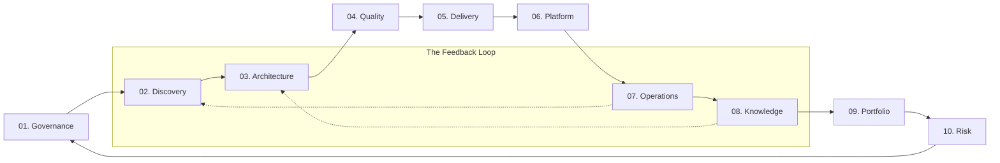

# Central Governance Repository

This repository is the concrete public instance of the organization's central governance system. It functions as a **Governance-as-Code** infrastructure, providing both the live operating model and a reusable library of technical standards.

## Table of Contents
- [Central Governance Repository](#central-governance-repository)
  - [Table of Contents](#table-of-contents)
  - [Governance Compass (Executive Index)](#governance-compass-executive-index)
  - [Governance Operating Model](#governance-operating-model)
    - [Repository Architecture](#repository-architecture)
    - [How to navigate](#how-to-navigate)
  - [Quick Start: Project Onboarding](#quick-start-project-onboarding)
- [Public Document Map (The Corpus)](#public-document-map-the-corpus)
  - [Primary Source Frameworks](#primary-source-frameworks)
  - [Governance Stewards \& Support](#governance-stewards--support)
  - [License \& Usage](#license--usage)
  - [Source Attribution](#source-attribution)

---

## Governance Compass (Executive Index)

The governance corpus is organized into 10 logical dimensions that follow the industrial technical lifecycle.

| Section | Governance Dimension | Focus Area | Status | Reusable Library |
| :--- | :--- | :--- | :--- | :--- |
| **01** | **Governance & Method** | Foundation & Norms | ✅ Ready | [`artifacts/01_Governance_Method/`](./artifacts/01_Governance_Method/) |
| **02** | **Discovery & Planning** | Ideation & Framing | ✅ Ready | [`artifacts/02_Discovery_Planning_Early_Learning/`](./artifacts/02_Discovery_Planning_Early_Learning/) |
| **03** | **Architecture & Security** | Design & Decision | ✅ Ready | [`artifacts/03_Architecture_Security_Decision/`](./artifacts/03_Architecture_Security_Decision/) |
| **04** | **Quality & Review** | Assurance & Ownership | ✅ Ready | [`artifacts/04_Quality_Review_Control/`](./artifacts/04_Quality_Review_Control/) |
| **05** | **Delivery & Readiness** | Change & Release | ✅ Ready | [`artifacts/05_Delivery_Change_Readiness/`](./artifacts/05_Delivery_Change_Readiness/) |
| **06** | **Platform & AI Ops** | Automation & AI Execution | ✅ Ready | [`artifacts/06_Platform_Delivery_Automation_AI_Operations/`](./artifacts/06_Platform_Delivery_Automation_AI_Operations/) |
| **07** | **Operations & Incidents** | Execution & Continuity | ✅ Ready | [`artifacts/07_Operations_Incidents_Continuity/`](./artifacts/07_Operations_Incidents_Continuity/) |
| **08** | **Knowledge & Learning** | Evolution & SRE | ✅ Ready | [`artifacts/08_Knowledge_Documentation_Continuous_Improvement/`](./artifacts/08_Knowledge_Documentation_Continuous_Improvement/) |
| **09** | **Project & Portfolio** | Strategy & Value | ✅ Ready | [`artifacts/09_Project_Portfolio_Service_Governance/`](./artifacts/09_Project_Portfolio_Service_Governance/) |
| **10** | **Risk & Traceability** | Control & Exceptions | ✅ Ready | [`artifacts/10_Risk_Exceptions_Traceability/`](./artifacts/10_Risk_Exceptions_Traceability/) |

---

## Governance Operating Model

The organization follows a **lifecycle-oriented governance flow**, where every project or service evolves through these standard gates.

### Repository Architecture
| Layer | Purpose | Location |
|---|---|---|
| **Repository Instance** | Concrete documents and GitHub-native files operating **this** repository | Root and `/.github/` |
| **Artifact Library** | Reusable standards, templates, schemas, and workflows for **downstream** projects | [`artifacts/`](./artifacts/README.md) |
| **Private Workspace** | Internal rationale and drafts not intended for publication | `/.private/` |

### How to navigate
- **Physical structure:** The [`artifacts/`](./artifacts/README.md) directory is organized into 10 numbered sections (01 to 10) matching this map.
- **Governance Enforcement:** Standards are enforced via deterministic validation. Refer to [`scripts/validate_governance_artifacts.py`](./scripts/validate_governance_artifacts.py).
- **Public provenance:** Source manifests live under [`sources/manifests/`](./sources/README.md) and are the public basis for traceable attribution.
- **Exceptions & Deviations:** Recorded via the [`Exception / Deviation Record`](./artifacts/10_Risk_Exceptions_Traceability/risk/templates/exception_deviation_record.md).

---

## Quick Start: Project Onboarding

To adopt this governance framework in a new repository, follow these three steps:

1.  **Initialize Metadata:** Copy the [Pull Request Template](./artifacts/04_Quality_Review_Control/quality/templates/pull_request_template.md) and [Issue Forms](./artifacts/04_Quality_Review_Control/quality/templates/issue_forms_and_templates.md) to your `.github/` folder.
2.  **Dimension Selection:** Identify which Governance Dimensions (01-10) apply to your project. Instantiate the corresponding `Normative` policies.
3.  **Validate Compliance:** Run the [Deterministic Validator](./scripts/validate_governance_artifacts.py) locally or integrate it into your CI/CD pipeline.

---

# Public Document Map (The Corpus)

Click on a dimension to explore its associated policies, standards, and templates. Links point to both the resource **Folder 📂** and the **Anchor Artifact ⚓**. Not every reusable support artifact appears as a top-level catalog row; supporting standards, playbooks, and helper assets remain discoverable inside each dimension folder.

<b>01. Governance & Method (Foundation & Norms)</b>

| Document | Nature | Public role | Primary source basis | Canonical primary artifact |
|---|---|---|---|---|
| README / Repository Overview | Normative | Presents the purpose and navigation | GitHub Docs | [Folder 📂](./artifacts/01_Governance_Method/governance/templates/) \| [Anchor ⚓](./artifacts/01_Governance_Method/governance/templates/repository_overview.md) |
| GOVERNANCE.md / Governance Overview | Normative | Explains how the system evolves | GitHub Docs | [Folder 📂](./artifacts/01_Governance_Method/governance/templates/) \| [Anchor ⚓](./artifacts/01_Governance_Method/governance/templates/governance_overview.md) |
| Engineering Handbook | Normative | Anchor document for the operating model | Scrum Guide | [Folder 📂](./artifacts/01_Governance_Method/governance/templates/) \| [Anchor ⚓](./artifacts/01_Governance_Method/governance/templates/engineering_handbook.md) |
| Workflow Definition | Normative | Defines dev, review, and delivery flows | GitHub Docs | [Folder 📂](./artifacts/01_Governance_Method/governance/standards/) \| [Anchor ⚓](./artifacts/01_Governance_Method/governance/standards/workflow_definition.md) |
| Contribution Guidelines | Normative | Explains how to submit changes | GitHub Docs | [Folder 📂](./artifacts/01_Governance_Method/governance/templates/) \| [Anchor ⚓](./artifacts/01_Governance_Method/governance/templates/contribution_guidelines.md) |
| Code of Conduct | Normative | Defines behavioral standards | GitHub Docs | [Folder 📂](./artifacts/01_Governance_Method/governance/policies/) \| [Anchor ⚓](./artifacts/01_Governance_Method/governance/policies/code_of_conduct_policy.md) |
| Coding Standards | Normative | Defines technical consistency standards | Microsoft Learn | [Folder 📂](./artifacts/01_Governance_Method/conventions/standards/) \| [Anchor ⚓](./artifacts/01_Governance_Method/conventions/standards/coding_standards.md) |
| Definition of Done / Quality Gates | Normative | States minimum completion criteria | Scrum Guide | [Folder 📂](./artifacts/01_Governance_Method/conventions/standards/) \| [Anchor ⚓](./artifacts/01_Governance_Method/conventions/standards/definition_of_done_quality_gates.md) |
| Documentation Policy | Normative | Defines level of rigor for documentation | Diataxis | [Folder 📂](./artifacts/01_Governance_Method/conventions/standards/) \| [Anchor ⚓](./artifacts/01_Governance_Method/conventions/standards/documentation_policy.md) |
| ADR Policy | Normative | Defines when a formal record is required | AWS Docs | [Folder 📂](./artifacts/01_Governance_Method/conventions/policies/) \| [Anchor ⚓](./artifacts/01_Governance_Method/conventions/policies/adr_policy.md) |
| Incident Management Policy | Normative | Defines severity, roles, and governance | NIST | [Folder 📂](./artifacts/01_Governance_Method/operations/policies/) \| [Anchor ⚓](./artifacts/01_Governance_Method/operations/policies/incident_management_policy.md) |
| Release & Versioning Policy | Normative | Defines release and versioning rules | Google SRE | [Folder 📂](./artifacts/01_Governance_Method/conventions/policies/) \| [Anchor ⚓](./artifacts/01_Governance_Method/conventions/policies/release_versioning_policy.md) |
| Knowledge Lifecycle Policy | Normative | Defines creation and archival of knowledge | Diataxis | [Folder 📂](./artifacts/01_Governance_Method/conventions/policies/) \| [Anchor ⚓](./artifacts/01_Governance_Method/conventions/policies/knowledge_lifecycle_policy.md) |

<b>02. Discovery, Planning & Early Learning (Ideation & Framing)</b>

| Document | Nature | Public role | Primary source basis | Canonical primary artifact |
|---|---|---|---|---|
| Discovery Brief / Problem Framing | Instantiable | Frames problem, goal, and constraints | Scrum Guide | [Folder 📂](./artifacts/02_Discovery_Planning_Early_Learning/discovery/templates/) \| [Anchor ⚓](./artifacts/02_Discovery_Planning_Early_Learning/discovery/templates/discovery_brief.md) |
| Product Goal / Outcome Statement | Instantiable | States the target product goal | Scrum Guide | [Folder 📂](./artifacts/02_Discovery_Planning_Early_Learning/discovery/templates/) \| [Anchor ⚓](./artifacts/02_Discovery_Planning_Early_Learning/discovery/templates/product_goal_outcome_statement.md) |
| Product Backlog | Instantiable | Inventory of prioritized future work | Scrum Guide | [Folder 📂](./artifacts/02_Discovery_Planning_Early_Learning/discovery/templates/) \| [Anchor ⚓](./artifacts/02_Discovery_Planning_Early_Learning/discovery/templates/product_backlog.md) |
| Planning Record | Instantiable | Records cycle goal and scope decisions | Scrum Guide | [Folder 📂](./artifacts/02_Discovery_Planning_Early_Learning/discovery/templates/) \| [Anchor ⚓](./artifacts/02_Discovery_Planning_Early_Learning/discovery/templates/planning_record.md) |
| Research / Experiment Log | Instantiable | Records hypotheses and observations | Google SRE | [Folder 📂](./artifacts/02_Discovery_Planning_Early_Learning/discovery/templates/) \| [Anchor ⚓](./artifacts/02_Discovery_Planning_Early_Learning/discovery/templates/research_experiment_log.md) |
| Assumptions Register | Instantiable | Makes unvalidated assumptions explicit | Microsoft Learn | [Folder 📂](./artifacts/02_Discovery_Planning_Early_Learning/discovery/templates/) \| [Anchor ⚓](./artifacts/02_Discovery_Planning_Early_Learning/discovery/templates/assumptions_register.md) |
| Technical Retrospective | Instantiable | Reviews an iteration or phase of work | Scrum Guide | [Folder 📂](./artifacts/02_Discovery_Planning_Early_Learning/discovery/templates/) \| [Anchor ⚓](./artifacts/02_Discovery_Planning_Early_Learning/discovery/templates/technical_retrospective.md) |
| Pre-mortem / Failure Scenario Review | Instantiable | Anticipates failure modes and impact | Google SRE | [Folder 📂](./artifacts/02_Discovery_Planning_Early_Learning/discovery/templates/) \| [Anchor ⚓](./artifacts/02_Discovery_Planning_Early_Learning/discovery/templates/pre_mortem_failure_scenario_review.md) |
| FMEA / Failure Mode Analysis | Instantiable | Preemptively analyzes mitigation | NIST | [Folder 📂](./artifacts/02_Discovery_Planning_Early_Learning/discovery/templates/) \| [Anchor ⚓](./artifacts/02_Discovery_Planning_Early_Learning/discovery/templates/fmea_failure_mode_analysis.md) |

<b>03. Architecture, Security & Decision (Design & Decision)</b>

| Document | Nature | Public role | Primary source basis | Canonical primary artifact |
|---|---|---|---|---|
| Architecture Decision Record (ADR) | Instantiable | Records hard-to-reverse decisions | AWS Docs | [Folder 📂](./artifacts/03_Architecture_Security_Decision/architecture/standards/) \| [Anchor ⚓](./artifacts/03_Architecture_Security_Decision/architecture/standards/architecture_decision_record_standard.md) |
| Design Rationale | Evidence | Preserves reasoning behind decisions | Microsoft Learn | [Folder 📂](./artifacts/03_Architecture_Security_Decision/architecture/templates/) \| [Anchor ⚓](./artifacts/03_Architecture_Security_Decision/architecture/templates/design_rationale.md) |
| Trade-off Analysis | Instantiable | Compares options with costs and risks | AWS Docs | [Folder 📂](./artifacts/03_Architecture_Security_Decision/architecture/templates/) \| [Anchor ⚓](./artifacts/03_Architecture_Security_Decision/architecture/templates/trade_off_analysis.md) |
| Architecture Review Record | Evidence | Records formal architecture review | Microsoft Learn | [Folder 📂](./artifacts/03_Architecture_Security_Decision/architecture/templates/) \| [Anchor ⚓](./artifacts/03_Architecture_Security_Decision/architecture/templates/architecture_review_record.md) |
| Threat Model | Instantiable | Models threats and defensive priorities | Microsoft Learn | [Folder 📂](./artifacts/03_Architecture_Security_Decision/architecture/templates/) \| [Anchor ⚓](./artifacts/03_Architecture_Security_Decision/architecture/templates/threat_model.md) |
| Security Requirements Record | Instantiable | Links requirements to mitigations | Microsoft Learn | [Folder 📂](./artifacts/03_Architecture_Security_Decision/architecture/templates/) \| [Anchor ⚓](./artifacts/03_Architecture_Security_Decision/architecture/templates/security_requirements_record.md) |

<b>04. Quality, Review & Control (Assurance & Ownership)</b>

| Document | Nature | Public role | Primary source basis | Canonical primary artifact |
|---|---|---|---|---|
| Review Ruleset / Merge Policy | Normative | Formalizes checks and merge policies | GitHub Docs | [Folder 📂](./artifacts/04_Quality_Review_Control/quality/standards/) \| [Anchor ⚓](./artifacts/04_Quality_Review_Control/quality/standards/review_ruleset_and_merge_policy.md) |
| CODEOWNERS / Ownership Map | Normative | Defines code and doc ownership | GitHub Docs | [Folder 📂](./artifacts/04_Quality_Review_Control/quality/standards/) \| [Anchor ⚓](./artifacts/04_Quality_Review_Control/quality/standards/codeowners_ownership_map.md) |
| Issue Forms / Issue Templates | Operational | Standardizes intake of requests | GitHub Docs | [Folder 📂](./artifacts/04_Quality_Review_Control/quality/templates/) \| [Anchor ⚓](./artifacts/04_Quality_Review_Control/quality/templates/issue_forms_and_templates.md) |
| Pull Request Template | Operational | Standardizes context and validation | GitHub Docs | [Folder 📂](./artifacts/04_Quality_Review_Control/quality/templates/) \| [Anchor ⚓](./artifacts/04_Quality_Review_Control/quality/templates/pull_request_template.md) |
| Security Policy | Normative | Defines vulnerability reporting | GitHub Docs | [Folder 📂](./artifacts/04_Quality_Review_Control/quality/policies/) \| [Anchor ⚓](./artifacts/04_Quality_Review_Control/quality/policies/security_policy.md) |
| Test Strategy / Verification Policy | Normative | Explains validation criteria | Google SRE | [Folder 📂](./artifacts/04_Quality_Review_Control/quality/standards/) \| [Anchor ⚓](./artifacts/04_Quality_Review_Control/quality/standards/test_strategy_and_verification_policy.md) |
| Operational / Production Readiness | Instantiable | Verifies change or service safety | Google SRE | [Folder 📂](./artifacts/04_Quality_Review_Control/quality/templates/) \| [Anchor ⚓](./artifacts/04_Quality_Review_Control/quality/templates/production_readiness_review.md) |
| Support Guidelines | Normative | Explains where to ask for help | GitHub Docs | [Folder 📂](./artifacts/04_Quality_Review_Control/quality/standards/) \| [Anchor ⚓](./artifacts/04_Quality_Review_Control/quality/standards/support_guidelines.md) |

<b>05. Delivery, Change & Readiness (Change & Release)</b>

| Document | Nature | Public role | Primary source basis | Canonical primary artifact |
|---|---|---|---|---|
| Release Plan / Rollout Plan | Instantiable | Defines order and rollout criteria | Google SRE | [Folder 📂](./artifacts/05_Delivery_Change_Readiness/delivery/templates/) \| [Anchor ⚓](./artifacts/05_Delivery_Change_Readiness/delivery/templates/release_plan_rollout_plan.md) |
| Release Checklist | Operational | Mandatory checks before publishing | GitHub Docs | [Folder 📂](./artifacts/05_Delivery_Change_Readiness/delivery/templates/) \| [Anchor ⚓](./artifacts/05_Delivery_Change_Readiness/delivery/templates/release_checklist.md) |
| Rollback / Backout Plan | Operational | Defines how to safely revert | Google SRE | [Folder 📂](./artifacts/05_Delivery_Change_Readiness/delivery/templates/) \| [Anchor ⚓](./artifacts/05_Delivery_Change_Readiness/delivery/templates/rollback_backout_plan.md) |
| Change Record | Instantiable | Records approved change and impact | NIST | [Folder 📂](./artifacts/05_Delivery_Change_Readiness/delivery/templates/) \| [Anchor ⚓](./artifacts/05_Delivery_Change_Readiness/delivery/templates/change_record.md) |
| Change Log / Release Notes | Evidence | Communicates what changed | GitHub Docs | [Folder 📂](./artifacts/05_Delivery_Change_Readiness/delivery/templates/) \| [Anchor ⚓](./artifacts/05_Delivery_Change_Readiness/delivery/templates/change_log_release_notes.md) |
| Change Communication | Instantiable | Defines message and channels | Google SRE | [Folder 📂](./artifacts/05_Delivery_Change_Readiness/delivery/templates/) \| [Anchor ⚓](./artifacts/05_Delivery_Change_Readiness/delivery/templates/change_communication.md) |
| Post-Implementation Review (PIR) | Evidence | Evaluates real outcomes | NIST | [Folder 📂](./artifacts/05_Delivery_Change_Readiness/delivery/templates/) \| [Anchor ⚓](./artifacts/05_Delivery_Change_Readiness/delivery/templates/post_implementation_review.md) |

<b>06. Platform Delivery, Automation & AI Operations (Automation & AI Execution)</b>

| Document | Nature | Public role | Primary source basis | Canonical primary artifact |
|---|---|---|---|---|
| CI/CD Policy | Normative | Defines automation behavior | GitHub Docs | [Folder 📂](./artifacts/06_Platform_Delivery_Automation_AI_Operations/platform/policies/) \| [Anchor ⚓](./artifacts/06_Platform_Delivery_Automation_AI_Operations/platform/policies/ci_cd_policy.md) |
| CI Workflow Record | Operational | Records automated build flows | GitHub Docs | [Folder 📂](./artifacts/06_Platform_Delivery_Automation_AI_Operations/platform/templates/) \| [Anchor ⚓](./artifacts/06_Platform_Delivery_Automation_AI_Operations/platform/templates/ci_workflow_build_pipeline_record.md) |
| CD / Deployment Record | Operational | Records automated deployment flows | Microsoft Learn | [Folder 📂](./artifacts/06_Platform_Delivery_Automation_AI_Operations/platform/templates/) \| [Anchor ⚓](./artifacts/06_Platform_Delivery_Automation_AI_Operations/platform/templates/cd_deployment_pipeline_record.md) |
| Environment Promotion Policy | Normative | Defines promotion rules across envs | Microsoft Learn | [Folder 📂](./artifacts/06_Platform_Delivery_Automation_AI_Operations/platform/policies/) \| [Anchor ⚓](./artifacts/06_Platform_Delivery_Automation_AI_Operations/platform/policies/environment_promotion_policy.md) |
| Deployment Configuration Record | Instantiable | Captures environment variables | GitHub Docs | [Folder 📂](./artifacts/06_Platform_Delivery_Automation_AI_Operations/platform/templates/) \| [Anchor ⚓](./artifacts/06_Platform_Delivery_Automation_AI_Operations/platform/templates/environment_deployment_configuration_record.md) |
| Infrastructure as Code Baseline | Instantiable | Records platform baseline patterns | OpenGitOps | [Folder 📂](./artifacts/06_Platform_Delivery_Automation_AI_Operations/platform/templates/) \| [Anchor ⚓](./artifacts/06_Platform_Delivery_Automation_AI_Operations/platform/templates/infrastructure_as_code_platform_baseline_record.md) |
| Artifact / Build Provenance | Evidence | Preserves traceability of artifacts | GitHub Docs | [Folder 📂](./artifacts/06_Platform_Delivery_Automation_AI_Operations/platform/templates/) \| [Anchor ⚓](./artifacts/06_Platform_Delivery_Automation_AI_Operations/platform/templates/artifact_build_provenance_record.md) |
| GitOps Policy | Normative | Defines declarative delivery rules | OpenGitOps | [Folder 📂](./artifacts/06_Platform_Delivery_Automation_AI_Operations/platform/policies/) \| [Anchor ⚓](./artifacts/06_Platform_Delivery_Automation_AI_Operations/platform/policies/gitops_policy.md) |
| GitOps Environment Definition | Instantiable | Defines desired state for workloads | Flux / Argo CD | [Folder 📂](./artifacts/06_Platform_Delivery_Automation_AI_Operations/platform/templates/) \| [Anchor ⚓](./artifacts/06_Platform_Delivery_Automation_AI_Operations/platform/templates/gitops_application_environment_definition.md) |
| MLOps / GenAIOps Policy | Normative | Defines model lifecycle governance | Google Cloud | [Folder 📂](./artifacts/06_Platform_Delivery_Automation_AI_Operations/platform/policies/) \| [Anchor ⚓](./artifacts/06_Platform_Delivery_Automation_AI_Operations/platform/policies/mlops_genaiops_policy.md) |
| Model Registry Record | Evidence | Tracks model versions and lineage | Microsoft Learn | [Folder 📂](./artifacts/06_Platform_Delivery_Automation_AI_Operations/platform/templates/) \| [Anchor ⚓](./artifacts/06_Platform_Delivery_Automation_AI_Operations/platform/templates/model_registry_record.md) |
| Dataset / Training Data Record | Evidence | Tracks data lineage and suitability | Microsoft Learn | [Folder 📂](./artifacts/06_Platform_Delivery_Automation_AI_Operations/platform/templates/) \| [Anchor ⚓](./artifacts/06_Platform_Delivery_Automation_AI_Operations/platform/templates/dataset_training_data_record.md) |
| Evaluation Suite / Benchmark | Instantiable | Defines metrics and comparison logic | OpenAI Docs | [Folder 📂](./artifacts/06_Platform_Delivery_Automation_AI_Operations/platform/templates/) \| [Anchor ⚓](./artifacts/06_Platform_Delivery_Automation_AI_Operations/platform/templates/evaluation_suite_benchmark_record.md) |
| Prompt / Instruction Registry | Instantiable | Tracks production prompts | OpenAI Docs | [Folder 📂](./artifacts/06_Platform_Delivery_Automation_AI_Operations/platform/templates/) \| [Anchor ⚓](./artifacts/06_Platform_Delivery_Automation_AI_Operations/platform/templates/prompt_system_instruction_registry.md) |
| Model Release / Serving Record | Instantiable | Records rollout and rollback context | Google Cloud | [Folder 📂](./artifacts/06_Platform_Delivery_Automation_AI_Operations/platform/templates/) \| [Anchor ⚓](./artifacts/06_Platform_Delivery_Automation_AI_Operations/platform/templates/model_release_serving_record.md) |
| Model Monitoring / Drift Report | Evidence | Records operational signals after deploy | Microsoft Learn | [Folder 📂](./artifacts/06_Platform_Delivery_Automation_AI_Operations/platform/templates/) \| [Anchor ⚓](./artifacts/06_Platform_Delivery_Automation_AI_Operations/platform/templates/model_monitoring_drift_report.md) |
| AI Safety / Guardrail Policy | Normative | Defines operational guardrails | OpenAI Docs | [Folder 📂](./artifacts/06_Platform_Delivery_Automation_AI_Operations/platform/policies/) \| [Anchor ⚓](./artifacts/06_Platform_Delivery_Automation_AI_Operations/platform/policies/ai_safety_guardrail_policy.md) |

<b>07. Operations, Incidents & Continuity (Execution & Continuity)</b>

| Document | Nature | Public role | Primary source basis | Canonical primary artifact |
|---|---|---|---|---|
| Service Overview / Fact Sheet | Instantiable | Summarizes operational context | AWS Docs | [Folder 📂](./artifacts/07_Operations_Incidents_Continuity/operations/templates/) \| [Anchor ⚓](./artifacts/07_Operations_Incidents_Continuity/operations/templates/service_fact_sheet.md) |
| Incident Response Plan | Normative | Defines process, roles, and escalation | NIST | [Folder 📂](./artifacts/07_Operations_Incidents_Continuity/operations/templates/) \| [Anchor ⚓](./artifacts/07_Operations_Incidents_Continuity/operations/templates/incident_response_plan.md) |
| Incident Report | Evidence | Records facts and impact | NIST | [Folder 📂](./artifacts/07_Operations_Incidents_Continuity/operations/templates/) \| [Anchor ⚓](./artifacts/07_Operations_Incidents_Continuity/operations/templates/incident_report.md) |
| Incident Timeline | Evidence | Preserves the chronology of events | Google SRE | [Folder 📂](./artifacts/07_Operations_Incidents_Continuity/operations/templates/) \| [Anchor ⚓](./artifacts/07_Operations_Incidents_Continuity/operations/templates/incident_timeline.md) |
| Playbook | Operational | Guides triage and decision-making | AWS Docs | [Folder 📂](./artifacts/07_Operations_Incidents_Continuity/operations/templates/) \| [Anchor ⚓](./artifacts/07_Operations_Incidents_Continuity/operations/templates/playbook.md) |
| Runbook | Operational | Guides mitigation and recovery | Google SRE | [Folder 📂](./artifacts/07_Operations_Incidents_Continuity/operations/templates/) \| [Anchor ⚓](./artifacts/07_Operations_Incidents_Continuity/operations/templates/runbook.md) |
| SOP (Standard Op. Procedure) | Operational | Standardizes stable processes | NIST | [Folder 📂](./artifacts/07_Operations_Incidents_Continuity/operations/templates/) \| [Anchor ⚓](./artifacts/07_Operations_Incidents_Continuity/operations/templates/standard_operating_procedure.md) |
| Incident Communications Plan | Operational | Defines channels and stakeholders | Google SRE | [Folder 📂](./artifacts/07_Operations_Incidents_Continuity/operations/templates/) \| [Anchor ⚓](./artifacts/07_Operations_Incidents_Continuity/operations/templates/incident_communications_plan.md) |
| On-call & Escalation Guide | Operational | Explains handoffs and response | Google SRE | [Folder 📂](./artifacts/07_Operations_Incidents_Continuity/operations/templates/) \| [Anchor ⚓](./artifacts/07_Operations_Incidents_Continuity/operations/templates/on_call_escalation_guide.md) |
| Service Continuity Plan / DR | Operational | Defines recovery and ISCP | NIST | [Folder 📂](./artifacts/07_Operations_Incidents_Continuity/continuity/templates/) \| [Anchor ⚓](./artifacts/07_Operations_Incidents_Continuity/continuity/templates/service_continuity_plan.md) |
| Exercise / Drill Record | Evidence | Records drills and extracted lessons | NIST | [Folder 📂](./artifacts/07_Operations_Incidents_Continuity/continuity/templates/) \| [Anchor ⚓](./artifacts/07_Operations_Incidents_Continuity/continuity/templates/exercise_drill_record.md) |

<b>08. Knowledge, Documentation & Continuous Improvement (Evolution & SRE)</b>

| Document | Nature | Public role | Primary source basis | Canonical primary artifact |
|---|---|---|---|---|
| Postmortem | Evidence | Blameless analysis of improvements | Google SRE | [Folder 📂](./artifacts/08_Knowledge_Documentation_Continuous_Improvement/knowledge/templates/) \| [Anchor ⚓](./artifacts/08_Knowledge_Documentation_Continuous_Improvement/knowledge/templates/postmortem.md) |
| Root Cause Analysis (RCA) | Evidence | Identifies explicit causes | NIST | [Folder 📂](./artifacts/08_Knowledge_Documentation_Continuous_Improvement/knowledge/templates/) \| [Anchor ⚓](./artifacts/08_Knowledge_Documentation_Continuous_Improvement/knowledge/templates/root_cause_analysis.md) |
| Lessons Learned | Evidence | Consolidates reusable lessons | Google SRE | [Folder 📂](./artifacts/08_Knowledge_Documentation_Continuous_Improvement/knowledge/templates/) \| [Anchor ⚓](./artifacts/08_Knowledge_Documentation_Continuous_Improvement/knowledge/templates/lessons_learned.md) |
| Corrective Action Register | Evidence | Tracks owner and due date | NIST | [Folder 📂](./artifacts/08_Knowledge_Documentation_Continuous_Improvement/knowledge/templates/) \| [Anchor ⚓](./artifacts/08_Knowledge_Documentation_Continuous_Improvement/knowledge/templates/corrective_action_register.md) |
| Knowledge Base Article | Instantiable | Reusable reference for knowledge | GitHub Docs | [Folder 📂](./artifacts/08_Knowledge_Documentation_Continuous_Improvement/knowledge/templates/) \| [Anchor ⚓](./artifacts/08_Knowledge_Documentation_Continuous_Improvement/knowledge/templates/knowledge_base_article.md) |
| Service Review / Reliability | Instantiable | Reviews health and improvement | Google SRE | [Folder 📂](./artifacts/08_Knowledge_Documentation_Continuous_Improvement/knowledge/templates/) \| [Anchor ⚓](./artifacts/08_Knowledge_Documentation_Continuous_Improvement/knowledge/templates/service_review.md) |
| SLO / Error Budget Policy | Normative | Formalizes service objectives | Google SRE | [Folder 📂](./artifacts/08_Knowledge_Documentation_Continuous_Improvement/knowledge/policies/) \| [Anchor ⚓](./artifacts/08_Knowledge_Documentation_Continuous_Improvement/knowledge/policies/slo_error_budget_policy.md) |
| Documentation Architecture | Normative | Organizes information model | Diataxis | [Folder 📂](./artifacts/08_Knowledge_Documentation_Continuous_Improvement/knowledge/standards/) \| [Anchor ⚓](./artifacts/08_Knowledge_Documentation_Continuous_Improvement/knowledge/standards/documentation_architecture_information_model.md) |
| Documentation Style Guide | Normative | Standardizes voice and structure | Microsoft Learn | [Folder 📂](./artifacts/08_Knowledge_Documentation_Continuous_Improvement/knowledge/standards/) \| [Anchor ⚓](./artifacts/08_Knowledge_Documentation_Continuous_Improvement/knowledge/standards/documentation_style_guide.md) |
| Ownership Matrix | Normative | Assigns review cadence to corpus | GitHub Docs | [Folder 📂](./artifacts/08_Knowledge_Documentation_Continuous_Improvement/knowledge/standards/) \| [Anchor ⚓](./artifacts/08_Knowledge_Documentation_Continuous_Improvement/knowledge/standards/documentation_review_ownership_matrix.md) |
| Deprecation & Archival Policy | Normative | Regulates document sunset | Diataxis | [Folder 📂](./artifacts/08_Knowledge_Documentation_Continuous_Improvement/knowledge/policies/) \| [Anchor ⚓](./artifacts/08_Knowledge_Documentation_Continuous_Improvement/knowledge/policies/deprecation_archival_policy.md) |
| Decision Log | Evidence | Records official decisions | GitHub Docs | [Folder 📂](./artifacts/08_Knowledge_Documentation_Continuous_Improvement/knowledge/standards/) \| [Anchor ⚓](./artifacts/08_Knowledge_Documentation_Continuous_Improvement/knowledge/standards/decision_log_standard.md) |

<b>09. Project, Portfolio & Service Governance (Strategy & Value)</b>

| Document | Nature | Public role | Primary source basis | Canonical primary artifact |
|---|---|---|---|---|
| Business Case / Value Case | Instantiable | Justifies initiative value and risk | PRINCE2 | [Folder 📂](./artifacts/09_Project_Portfolio_Service_Governance/project-governance/templates/) \| [Anchor ⚓](./artifacts/09_Project_Portfolio_Service_Governance/project-governance/templates/business_case.md) |
| Project Charter / Brief | Instantiable | Frames authority and scope | PMI | [Folder 📂](./artifacts/09_Project_Portfolio_Service_Governance/project-governance/templates/) \| [Anchor ⚓](./artifacts/09_Project_Portfolio_Service_Governance/project-governance/templates/project_charter.md) |
| Project Management Plan | Instantiable | Consolidates baseline approach | PRINCE2 | [Folder 📂](./artifacts/09_Project_Portfolio_Service_Governance/project-governance/templates/) \| [Anchor ⚓](./artifacts/09_Project_Portfolio_Service_Governance/project-governance/templates/project_initiation_management_plan.md) |
| Stakeholder Register | Instantiable | Records key stakeholders and roles | PMI | [Folder 📂](./artifacts/09_Project_Portfolio_Service_Governance/project-governance/templates/) \| [Anchor ⚓](./artifacts/09_Project_Portfolio_Service_Governance/project-governance/templates/stakeholder_register.md) |
| Communications Plan | Instantiable | Defines objectives and channels | PMI | [Folder 📂](./artifacts/09_Project_Portfolio_Service_Governance/project-governance/templates/) \| [Anchor ⚓](./artifacts/09_Project_Portfolio_Service_Governance/project-governance/templates/communications_management_plan.md) |
| Issue Log / Register | Evidence | Tracks issues requiring action | PRINCE2 | [Folder 📂](./artifacts/09_Project_Portfolio_Service_Governance/project-governance/templates/) \| [Anchor ⚓](./artifacts/09_Project_Portfolio_Service_Governance/project-governance/templates/issue_log_register.md) |
| Status / Highlight Report | Evidence | Periodic visibility into health | PRINCE2 | [Folder 📂](./artifacts/09_Project_Portfolio_Service_Governance/project-governance/templates/) \| [Anchor ⚓](./artifacts/09_Project_Portfolio_Service_Governance/project-governance/templates/status_highlight_report.md) |
| Exception / Escalation Report | Evidence | Records deviations beyond tolerances | PRINCE2 | [Folder 📂](./artifacts/09_Project_Portfolio_Service_Governance/project-governance/templates/) \| [Anchor ⚓](./artifacts/09_Project_Portfolio_Service_Governance/project-governance/templates/exception_escalation_report.md) |
| Benefits Review Record | Evidence | Reviews if benefits were achieved | PMI | [Folder 📂](./artifacts/09_Project_Portfolio_Service_Governance/project-governance/templates/) \| [Anchor ⚓](./artifacts/09_Project_Portfolio_Service_Governance/project-governance/templates/benefits_realization_record.md) |
| Service Catalog | Instantiable | Defines the service value proposition | ITIL | [Folder 📂](./artifacts/09_Project_Portfolio_Service_Governance/project-governance/templates/) \| [Anchor ⚓](./artifacts/09_Project_Portfolio_Service_Governance/project-governance/templates/service_catalog.md) |
| Service Level Policy / SLA | Normative | Formalizes SLAs and commitments | ITIL | [Folder 📂](./artifacts/09_Project_Portfolio_Service_Governance/project-governance/policies/) \| [Anchor ⚓](./artifacts/09_Project_Portfolio_Service_Governance/project-governance/policies/service_level_policy.md) |
| Service Request Model | Operational | Optimizes delivery through request models | ITIL | [Folder 📂](./artifacts/09_Project_Portfolio_Service_Governance/project-governance/templates/) \| [Anchor ⚓](./artifacts/09_Project_Portfolio_Service_Governance/project-governance/templates/service_request_model.md) |
| Problem Management Policy | Normative | Practice for reducing incident recurrence | ITIL | [Folder 📂](./artifacts/09_Project_Portfolio_Service_Governance/project-governance/policies/) \| [Anchor ⚓](./artifacts/09_Project_Portfolio_Service_Governance/project-governance/policies/problem_management_policy.md) |
| Known Error Record | Evidence | Preserves diagnosed workarounds | ITIL | [Folder 📂](./artifacts/09_Project_Portfolio_Service_Governance/project-governance/templates/) \| [Anchor ⚓](./artifacts/09_Project_Portfolio_Service_Governance/project-governance/templates/known_error_record.md) |
| Service Configuration Asset | Evidence | Maintains traceable service components | ITIL | [Folder 📂](./artifacts/09_Project_Portfolio_Service_Governance/project-governance/templates/) \| [Anchor ⚓](./artifacts/09_Project_Portfolio_Service_Governance/project-governance/templates/service_configuration_asset_record.md) |

<b>10. Risk, Exceptions & Traceability (Control & Exceptions)</b>

| Document | Nature | Public role | Primary source basis | Canonical primary artifact |
|---|---|---|---|---|
| Risk Register | Evidence | Tracks risks, impact, and mitigation | NIST | [Folder 📂](./artifacts/10_Risk_Exceptions_Traceability/risk/templates/) \| [Anchor ⚓](./artifacts/10_Risk_Exceptions_Traceability/risk/templates/risk_register.md) |
| Exception / Deviation Record | Evidence | Records deliberate policy deviations | Microsoft Learn | [Folder 📂](./artifacts/10_Risk_Exceptions_Traceability/risk/templates/) \| [Anchor ⚓](./artifacts/10_Risk_Exceptions_Traceability/risk/templates/exception_deviation_record.md) |
| Security Advisory Record | Evidence | Records public advisories and remediation | GitHub Docs | [Folder 📂](./artifacts/10_Risk_Exceptions_Traceability/risk/templates/) \| [Anchor ⚓](./artifacts/10_Risk_Exceptions_Traceability/risk/templates/security_advisory_vulnerability_record.md) |
| Audit Trail Policy | Normative | Defines minimum traceability rules | NIST | [Folder 📂](./artifacts/10_Risk_Exceptions_Traceability/risk/policies/) \| [Anchor ⚓](./artifacts/10_Risk_Exceptions_Traceability/risk/policies/audit_trail_policy.md) |
| Metrics & Review Cadence | Normative | Establishes review moments for governance | Scrum Guide | [Folder 📂](./artifacts/10_Risk_Exceptions_Traceability/risk/standards/) \| [Anchor ⚓](./artifacts/10_Risk_Exceptions_Traceability/risk/standards/metrics_review_cadence.md) |

---

## Primary Source Frameworks

This governance system is a hybrid synthesis of the following official source families:

- [**GitHub Docs**](https://docs.github.com/) - Community health files, repository governance, issue forms, pull request templates, workflows, and security reporting surfaces.
- [**Scrum Guide**](https://scrumguides.org/scrum-guide.html) - Planning, backlog management, iteration cadence, and retrospectives.
- [**Diataxis**](https://diataxis.fr/) - Documentation architecture and information design.
- [**NIST / CISA**](https://www.nist.gov/cyberframework) - Incident response, risk management, auditability, and continuity-aligned governance.
- [**Google SRE**](https://sre.google/workbook/) - Postmortems, error budgets, operational readiness, and reliability learning loops.
- [**AWS Well-Architected**](https://docs.aws.amazon.com/wellarchitected/latest/framework/welcome.html) - Architecture trade-offs, reliability, and operational readiness.
- [**Microsoft Learn**](https://learn.microsoft.com/) - Platform delivery, security, architecture, and operational practice guidance.
- [**OpenAI Docs**](https://platform.openai.com/docs/overview) - AI operations, evaluation, prompt lifecycle, and safety guidance.
- [**PMI**](https://www.pmi.org/) - Project framing, stakeholder and communications governance.
- [**PRINCE2**](https://www.peoplecert.org/browse-certifications/project-programme-and-portfolio-management/PRINCE2-7) - Business case, project governance, and exception reporting.
- [**ITIL / PeopleCert**](https://www.peoplecert.org/browse-certifications/it-governance-and-service-management/ITIL-1) - Service catalog, service levels, requests, change enablement, and problem management.

Public source manifests for the currently adopted source families are published in [`sources/manifests/`](./sources/README.md).

## Governance Stewards & Support

This repository is maintained through pull requests, deterministic validation, and curator review by the repository maintainer.

- **Support:** Open an [Investigation Request](./.github/ISSUE_TEMPLATE/investigation_request.yml) for framework guidance.
- **Reporting:** Use [Incident Report](./.github/ISSUE_TEMPLATE/incident_report.yml) for governance breaches.

---

## License & Usage

This governance corpus is licensed under the [**MIT License**](./LICENSE). Reusable artifacts are provided as-is for organizational instantiation.

## Source Attribution

- **Source manifests:** [`governance__github_docs.md`](./sources/manifests/governance__github_docs.md), [`platform__aws_well_architected.md`](./sources/manifests/platform__aws_well_architected.md), [`platform__microsoft_learn.md`](./sources/manifests/platform__microsoft_learn.md)
- **Primary source basis:** GitHub Docs community governance guidance plus industrial technical frameworks.
- **Alignment mode:** `hybrid-synthesis`
- **Reviewed on:** 2026-03-28
